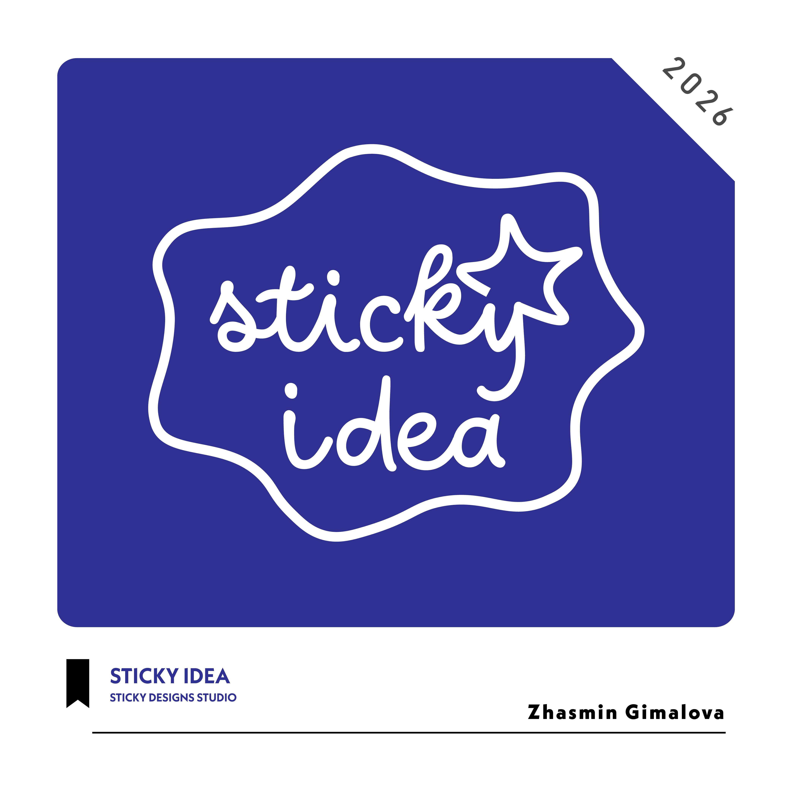
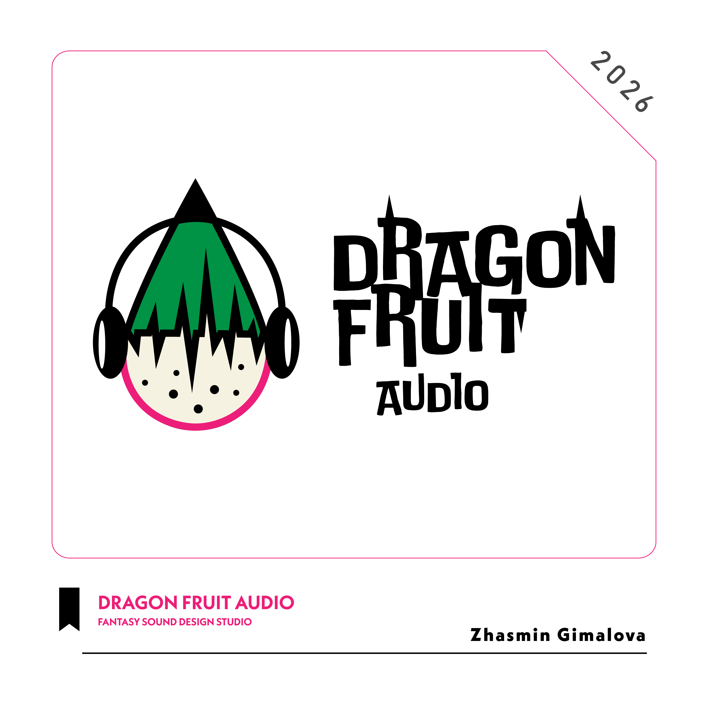
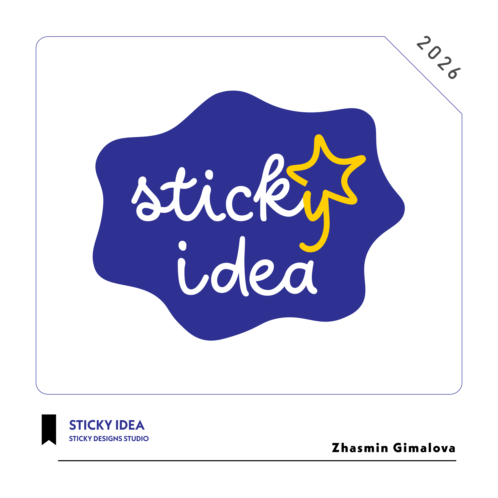

# Zhasmin Gimalova

## Graphic / Brand Designer

### www.linkedin.com/in/zhasmin-gimalova-276741328
### Phone number: 12345678910
### Portfolio Link: < in progress >

### Professional summary

*Graphic and Brand Designer* with a strong foundation in visual communication, brand strategy, and creative problem-solving. Experienced in developing cohesive brand identities that express a company’s personality, values, and goals across both digital and print environments. Creates distinctive logos, color systems, typography, packaging, social media content, marketing materials, presentations, and campaign assets that feel consistent, polished, and purposeful. Skilled at turning ideas, research, and business objectives into clear visual stories that connect with the right audience. Combines creative thinking with close attention to detail, ensuring every design element supports both usability and brand recognition. Comfortable collaborating with clients, marketing teams, photographers, developers, and other creative partners from initial concept through final delivery.

## Projects

## Skills
- Brand identity design  
- Logo design  
-  Art direction  
- Visual storytelling  
- Typography  
- Color theory  
- Layout and composition  
- Adobe Creative Suite  
- Figma 
- Digital design

## Transferable skills 

-Creative problem-solving  
-Visual communication  
-Attention to detail  
-Time management  
-Project coordination  
-Client communication  
-Presentation skills  
-Active listening

## Experience section

Freelance Graphic Designer

Remote | 2025–2026  

-Designed logos, social content, and marketing materials.

-Collaborated with clients from concept to final delivery.

-Delivered polished designs that supported client growth.

## Contact Me

#### www.linkedin.com/in/zhasmin-gimalova-276741328
#### Phone number: 12345678910
